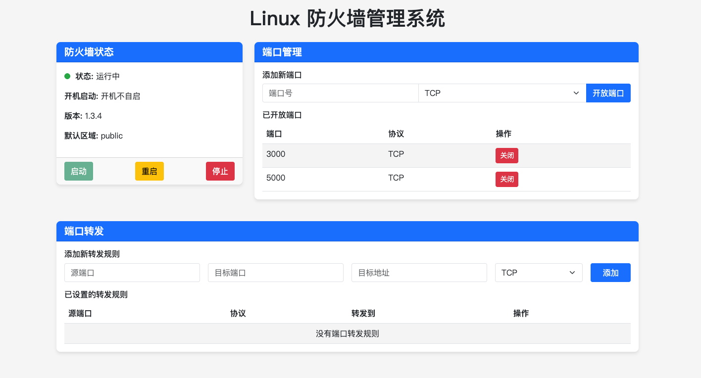

# Linux 防火墙Web管理系统

这是一个基于Web界面的Linux防火墙(firewalld)管理工具，可以帮助用户通过浏览器方便地管理Linux系统的防火墙服务。

## 功能特点

- 监控防火墙运行状态
- 启动/停止/重启防火墙服务
- 管理端口的开放与关闭
- 配置端口转发规则

## 技术栈

- 后端：Python Flask
- 前端：HTML、CSS、JavaScript
- 防火墙：Firewalld

## 系统要求

- Python 3.6+
- Linux系统
- 已安装firewalld服务

## 安装与使用

1. 克隆项目到本地

```bash
git clone https://github.com/bystart/firewalld-manager.git
cd firewalld-manager
```

2. 安装依赖

```bash
pip install -r requirements.txt
```

3. 运行应用

```bash
python run.py
```

4. 在浏览器中访问 `http://<your-server-ip>:3000`

## 注意事项

- 本应用需要root权限才能管理防火墙服务，建议使用sudo运行
- 在生产环境中，请设置适当的安全措施，如HTTPS和身份验证
- 建议在实际部署中使用Gunicorn或uWSGI作为WSGI服务器
